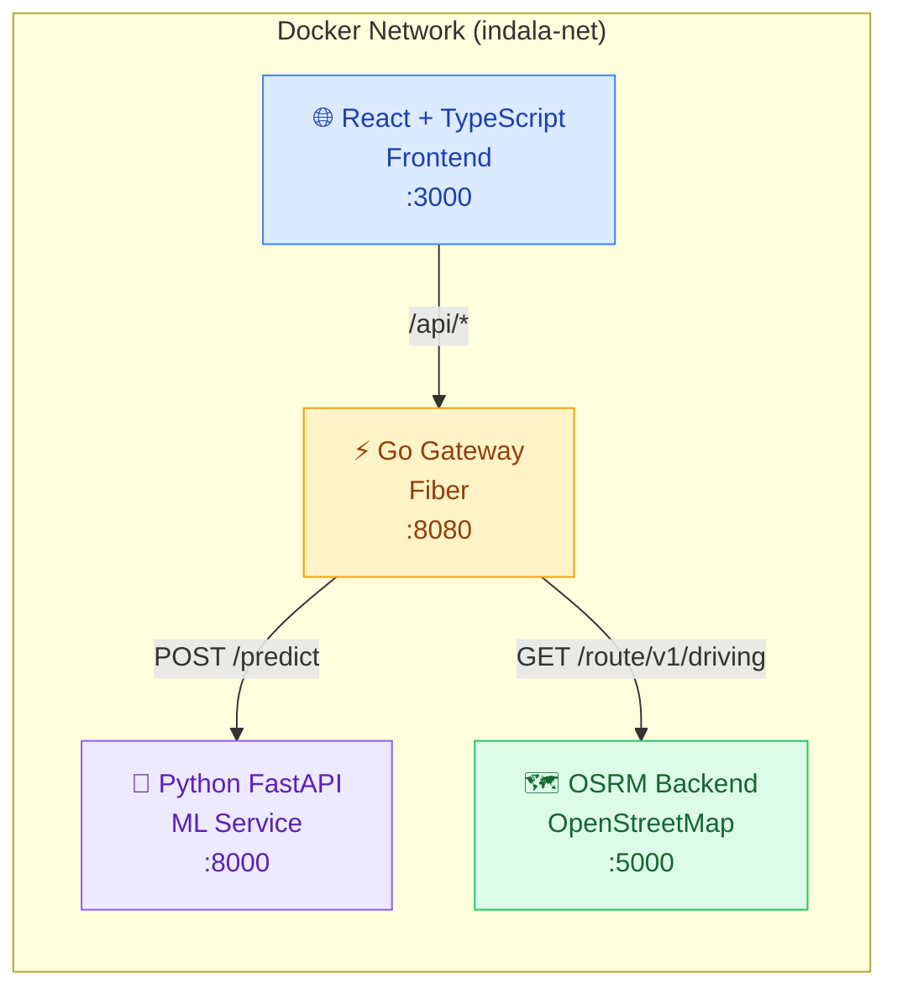

# 🚗 inDala AI — Предиктивная система оценки сельской мобильности

> **Decentrathon 5.0** | Track: inDrive — Справедливая мобильность

---

## 📋 Проблема: «Слепые зоны» логистики

Более **40% населения Казахстана** живет в сельской местности. Для них любая поездка в город — это не роскошь, а жизненная необходимость (врачи, ЦОНы, учеба). 

**Текущая ситуация:**
- **Рыночный провал:** Водители inDrive не едут в аулы, так как это убыточно (пустой обратный путь, плохие дороги).
- **Неэффективность государства:** Субсидии распределяются линейно, без учета реальной сложности и социальной важности конкретного маршрута в конкретный день.

---

## 💡 Решение: Алгоритмический расчет социальных субсидий

**inDala AI** — это интеллектуальный движок, который превращает социальную уязвимость в понятный финансовый стимул для водителей.

### Как это работает:
1. **Интерактивный ввод:** Пользователь кликает на карту — выбирает точки маршрута.
2. **Гео-аналитика (OSRM):** Система строит точный путь по дорожному графу Казахстана.
3. **ML-скоринг (XGBoost):** Модель оценивает «Индекс уязвимости» маршрута на основе близости больниц, качества дорог и плотности населения.
4. **Объяснимый AI (SHAP):** Система выдает прозрачный отчет: почему назначена именно такая сумма (например, «Нет больниц в радиусе 80 км: +26.8 баллов»).
5. **Экономический выход:** Рекомендация точной суммы субсидии в ₸ для привлечения водителя.

---

## 🏗️ Архитектура

> Полиглотная микросервисная архитектура



### Обоснование выбора технологий

| Компонент | Технология | Почему |
|:--|:--|:--|
| **API Gateway** | Go (Fiber) | Высокая пропускная способность, низкая латентность. Идеально для data-intensive систем *(Kleppmann, Ch.1)* |
| **ML Service** | Python (FastAPI) | Изоляция ML для независимого масштабирования. Разделение ответственности *(Ch.4)* |
| **Routing** | OSRM | **Air-gapped** маршрутизация: данные карт не покидают контур — критично для GovTech |
| **Frontend** | React + TypeScript | Интерактивная карта Leaflet с click-to-place маршрутами |

> [!IMPORTANT]
> **Security by design**: OSRM работает полностью локально. Все геоданные обрабатываются внутри Docker-контура без обращений к внешним API. Это ключевое требование для государственных проектов (GovTech).

### Ключевые архитектурные принципы

- **Reliability** — каждый сервис изолирован; падение ML не роняет gateway
- **Scalability** — горизонтальное масштабирование: `docker compose scale python-ml=3`
- **Maintainability** — ML-инженеры работают с Python, backend с Go, фронтенд отдельно

---

## 🚀 Быстрый старт

### Предварительные требования

- [Docker](https://docs.docker.com/get-docker/) + Docker Compose
- ~2 ГБ свободного места (для карты Казахстана)

### 1. Клонируем и настраиваем

```bash
git clone https://github.com/OJsnuly/indala-ai.git
cd indala-ai
cp .env.example .env
```

### 2. Скачиваем карту Казахстана

```bash
wget -P osrm-data/ https://download.geofabrik.de/asia/kazakhstan-latest.osm.pbf
```

> [!NOTE]
> Файл ~300 МБ. При первом запуске OSRM автоматически обработает его (extract → partition → customize). Это займёт 3-5 минут.

### 3. Запускаем

```bash
docker compose up --build
```

### Доступ

| Сервис | Порт по умолчанию | Описание |
|:--|:--|:--|
| 🌐 Frontend | [localhost:3000](http://localhost:3000) | Интерактивная карта |
| ⚡ API Gateway | [localhost:8080](http://localhost:8080/health) | Go Fiber |
| 🧠 ML Service | [localhost:8000](http://localhost:8000/health) | FastAPI |
| 🗺️ OSRM | [localhost:5000](http://localhost:5000) | Routing engine |

> [!NOTE]
> Порты настраиваются через `.env`. Если фронтенд запущен через Vite dev-сервер, порт по умолчанию — `5173`.

### Проверка API

```bash
curl -X POST http://localhost:8080/api/v1/analyze-route \
  -H "Content-Type: application/json" \
  -d '{
    "start_lat": 51.1282,
    "start_lng": 71.4304,
    "end_lat": 50.5889,
    "end_lng": 69.9916
  }'
```

---

## 📁 Структура проекта

```
indala-ai/
├── docker-compose.yml          # 4 сервиса: frontend, go-api, python-ml, osrm
├── .env.example                # Шаблон переменных окружения
├── .gitignore
├── README.md
├── gateway/                    # Go API Gateway
│   ├── main.go                 # Fiber + OSRM [lon,lat] + ML proxy
│   ├── go.mod / go.sum
│   └── Dockerfile
├── ml-service/                 # Python ML сервис
│   ├── main.py                 # FastAPI + mock XGBoost + SHAP
│   ├── requirements.txt
│   └── Dockerfile
├── frontend/                   # React Frontend
│   ├── src/
│   │   ├── App.tsx             # Карта с click-to-place + GeoJSON маршрут
│   │   ├── main.tsx
│   │   ├── index.css           # Светлая тема
│   │   └── types.ts
│   ├── nginx.conf              # Конфигурация веб-сервера
│   └── Dockerfile
└── osrm-data/                  # Данные OSRM (gitignored)
    └── kazakhstan-latest.osm.pbf  ← скачать вручную
```

---

## 🧠 ML Модель

**Текущая версия:** `mock-xgboost-v0.2.0` (прототип)

> [!TIP]
> Модель детерминированная: одни и те же координаты всегда дают одинаковый результат. Для продакшена будет training pipeline на реальных данных stat.gov.kz + OpenWeather.

| Фактор уязвимости | Вклад в индекс |
|:--|:--|
| Отсутствие больниц (50 км) | +8..35 |
| Суровые зимние условия | +5..25 |
| Нет асфальтированных дорог | +10..30 |
| Нет общественного транспорта | +10..30 |
| Сезонное бездорожье | +5..20 |

**Формула субсидии:** `base_rate (45₸/км) × distance × (1 + score/100 × 1.5)`

---

<p align="center">
  Сделано с 💙 для <strong>Decentrathon 5.0</strong> | Трек: inDrive
</p>
